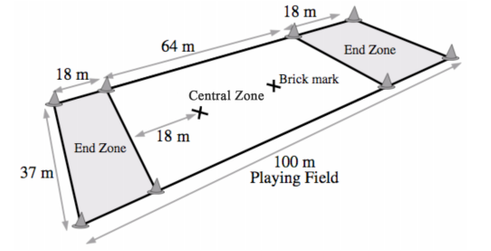

## Wstęp

Ultimate to siedmioosobowy sport drużynowy, w którym gra się latającym dyskiem. Gra odbywa się na prostokątnym boisku o szerokości około połowy boiska do piłki nożnej, ze strefami końcowymi na każdym końcu. Celem każdego zespołu jest zdobycie punktu poprzez złapanie dysku przez zawodnika w strefie, na którą zespół atakuje. Rzucający nie może biegać z dyskiem, natomiast może podać dysk  w dowolnym kierunku do innego zawodnika swojej drużyny. Jeśli rzut jest nieudany, następuje strata dysku, przejmuje go drużyna przeciwna i stara się zdobyć punkt atakując na przeciwległą stronę boiska. Mecze rozgrywane są przeważnie do 15 punktów i trwają ok 100 minut. Ultimate jest sportem bezkontaktowym, w którym nie ma sędziego. Zgodnie z Duchem Gry (Spirit of the Game) to zawodnicy sami sędziują, pilnują zasad i rozwiązują sytuacje sporne na boisku.

Wiele z zasad Ultimate jest dość ogólnych, ale pokrywają one większość sytuacji. Zdarzają się jednak wyjątki, w których obowiązują bardziej konkrente zasady.

## 1. Duch Gry (Spirit of the Game)

### 1.1

Ultimate jest bezkontaktowym sportem w którym nie ma sędziego. Wszyscy zawodnicy są odpowiedzialni za przestrzeganie	i stosowanie się do zasad gry. Ultimate kładzie nacisk na Ducha Gry (Spirit of the Game), który zobowiązuje każdego zawodnika do gry fair.

### 1.2

Zakłada się, że żaden zawodnik celowo nie łamie zasad gry, dlatego w przypadku nieumyślnego naruszenia zasad nie ma surowych kar, jest tylko metoda wznowienia gry w sposób, który prawdopodobnie wystąpiłby, gdyby tego naruszenia nie było.

### 1.3

Zawodnicy powinni być świadomi, że pełnią rolę sędziów w każdej spornej sytuacji między drużynami. Dlatego powinni:

- znać zasady
- być obiektywni
- być prawdomówni
- dokładnie, ale krótko wyjaśniać swój punkt widzenia
- pozwolić przeciwnikowi się wypowiedzieć
- rozwiązywać spory tak szybko, jak to możliwe z szacunkiem do innych zawodników
- zgłaszać naruszenia spójnie/tak samo podczas całej gry 
- zgłaszać naruszenia tylko jeśli mają wpływ na wynik akcji

### 1.4

Współzawodnictwo jest zalecane, natomiast rywalizacja nie powinna odbywać się kosztem wzajemnego szacunku do zawodników, respektowania przepisów czy zwykłej przyjemności z gry.

### 1.5

Poniższe działania obrazują dobrego ducha gry:

- informowanie zawodnika swojej drużyny o tym, że nieprawidłowo lub niepotrzebnie zgłosił naruszenie zasad, albo sam spowodował faul lub inne naruszenie zasad.
- wycofanie zgłoszenia naruszenia zasad, jeśli uważasz, że zgłoszenie było niepotrzebne
- docenianie przeciwnika za dobrą akcję lub po prostu grę fair
- przywitanie się z przeciwnikiem
- spokoja reakcja na brak porozumienia ze strony przeciwnika lub prowokację

### 1.6

Poniższe działania są jawnym naruszeniem Ducha Gry i wszyscy zawodnicy powinni ich unikać:

- niebezpieczne i agresywne zagrania i zachowania
- faule i inne naruszenia zasad wykonywane z premedytacją
- wyśmiewanie lub zastraszanie zawodników drużyny przeciwnej
- nonszalanckie i lekceważące celebrowanie zdobytego punktu
- zgłaszanie naruszeń w rewanżu za zgłoszenie naruszenia przez przeciwnika
- wzywanie do podania dysku przez gracza drużyny przeciwnej

### 1.7

Drużyny są strażnikami Ducha Gry i są zobowiązane:

- brać odpowiedzialność za przekazanie wiedzy i nauczenie swoich zawodników zasad gry
- dyscyplinowanie zawodników, którzy nie stosują się do zasad i Ducha Gry
- dawać innym zespołom konstruktywne opinie na temat tego, co mogą poprawić w kwestii trzymania się zasad i Ducha Gry

### 1.8

W przypadku, kiedy nowy zawodnik naruszy zasady z powodu braku wiedzy na ich temat, bardziej doświadczeni zawodnicy zobowiązani są mu wyjaśnić i wytłumaczyć popełnione naruszenie.

### 1.9

Doświadczony zawodnik może nadzorować grę początkujących i młodszych zawodników, doradzając w kwestii zasad i pomagając w rozstrzyganiu sporów na boisku.

### 1.10

Zasady powinny być interpretowane bezpośrednio przez zawodników zaangażowanych w grę, lub takich którzy bardzo dobrze widzieli daną sytuację. Osoby nie będące graczami, z wyjątkiem kapitanów drużyn, powinny powstrzymać się od angażowania w wyjaśnianie danej sytuacji, jednakże takie osoby mogą zostać poproszone o wyjaśnienie zasad i przedstawienie własnego punktu widzenia po to by można było zgłosić odpowiednie naruszenie.

### 1.11

Wyłącznie zawodnicy i kapitanowie drużyn mogą zgłaszać naruszenia.

### 1.12

Jeśli w wyniku dyskusji zawodnicy nie mogą dojść do porozumienia, lub jeśli nie jest do końca jasne:

- co zaszło podczas gry
- co prawdopodobnie stałoby się dalej

dysk wraca do ostatniego zawodnika przed zgłoszeniem naruszenia.

## 2. Boisko

### 2.1

Gra odbywa się na prostokątnym boisku o wymiarach jak na rysunku 1. Boisko powinno być płaskie, wolne od przeszkód i zapewniać względne bezpieczeństwo zawodnikom.

### 2.2

Linie obwodu boiska składają się z 2 linii bocznych po dłuższych stronach boiska i 2 linii końcowych.

### 2.3

Linie obwodu boiska nie są częścią pola gry.

### 2.4

Linie strefy to linie które oddzielają centralną część boiska od stref końcowych. Są one częścią strefy centralnej.

### 2.5

"Brick" to miejsce składające się z dwóch 1-metrowych, przecinających się linii w centralnej części boiska oddalone 18 metrów od każdej ze stref końcowych i po środku odległości między liniami bocznymi.

### 2.6

Obszary stref końcowych i centralnej części boiska są zaznaczone ośmioma widocznymi znacznikami (np. plastikowe pachołki) ustawionymi w narożnikach każdej ze stref.

### 2.7

Obszar bezpośrednio wokół boiska powinien być bezpieczny, wolny od przeszkód i ruchomych obiektów. Jeśli gra jest utrudniona przez osoby nie będące zawodnikami lub przedmioty znajdujące się w obrębie 3 metrów od linii obwodu boiska, każdy zawodnik któremu to przeszkodziło w grze może zgłosić naruszenie zasad.

	
	 
	1. Boisko do gry w Ultimate

## 3. Sprzęt do gry

### 3.1

Do gry może zostać użyty dowolny latający dysk zaakceptowany przez kapitanów obu drużyn.

### 3.2

WFDF może prowadzić wykaz zaakceptowanych i rekomendowanych do gry dysków.

### 3.3

Każdy zawodnik powinien być ubrany w strój swojej drużyny

### 3.4

Gracze nie mogą mieć elementów stroju, które potencjalnie zagrażają, lub mogą zranić innych zawodników, albo utrudniać im grę.

## 4. Punkty i mecz

### 4.1

Mecz trwa do zdobycia konkretnej liczby punktów.

### 4.2

Mecz kończy się i jest wygrany przez drużynę, która jako pierwsza zdobyła 15 punktów

### 4.3

Mecz jest podzielony na 2 części. Przerwa następuje, kiedy jedna z drużyn zdobędzie 8 punktów.

### 4.4

Pierwsza akcja każdej połowy, zaczyna się w momencie rozpoczęcia danej części gry.

### 4.5

Po zdobytym punkcie, kiedy gra nie jest jeszcze skończona i nie następuje przerwa między połowami:

- od razu rozgrywana jest następna akcja 
- drużyny zamieniają się stronami których bronią
- drużyna, która zdobyła punkt staje się drużyną broniąca

### 4.6

Zasady gry mogą być odpowiednio dostosowane w przypadku specjalnych rodzajów zawodów, innej liczby graczy, ich wieku lub dostępnej do gry przestrzeni.

## 5. Drużyny

### 5.1

Każdy zespół składa się z maksymalnie 7 a minimalnie 5 graczy na boisku w każdej akcji.

### 5.2

Drużyna może przeprowadzić nielimitowaną ilość zmian po punkcie zdobytym przez każdą z drużyn, ale musi to nastąpić przed sygnalizacją gotowości do wznowienia gry.

### 5.3

Każda drużyna wyznacza kapitana, który ją reprezentuje.

## 6. Rozpoczęcie gry

### 6.1

Reprezentanci obu drużyn decydują, która drużyna jako pierwsza wybiera:

- czy jest stroną atakującą, czy broniącą
- strone boiska/strefę, której początkowo broni

### 6.2

Druga drużyna dostaje pozostałe opcje.

### 6.3

Na początku drugiej połowy powyższe ustalenia i wybory są zamieniane.

